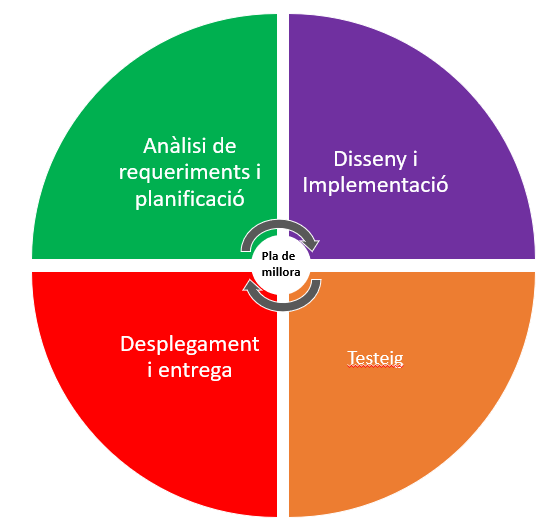
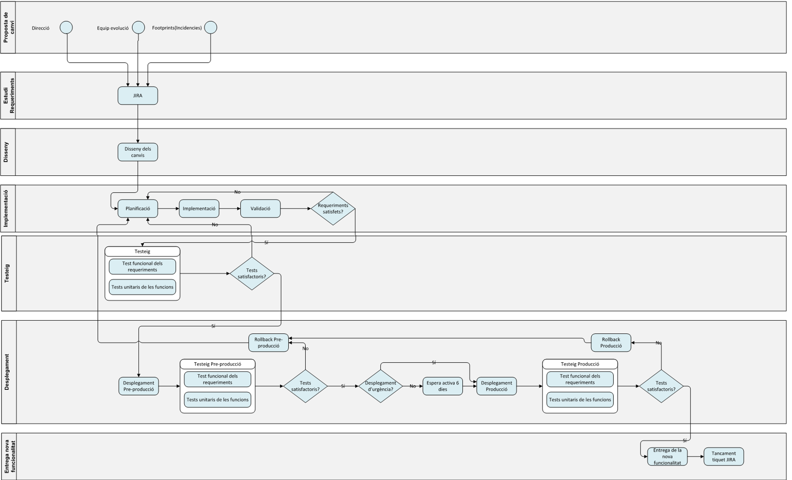
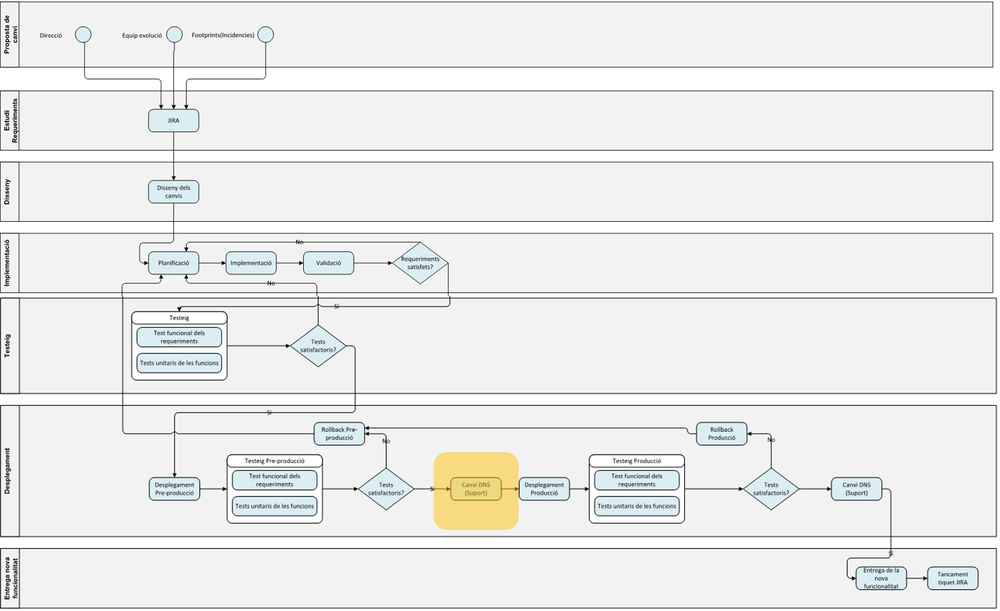
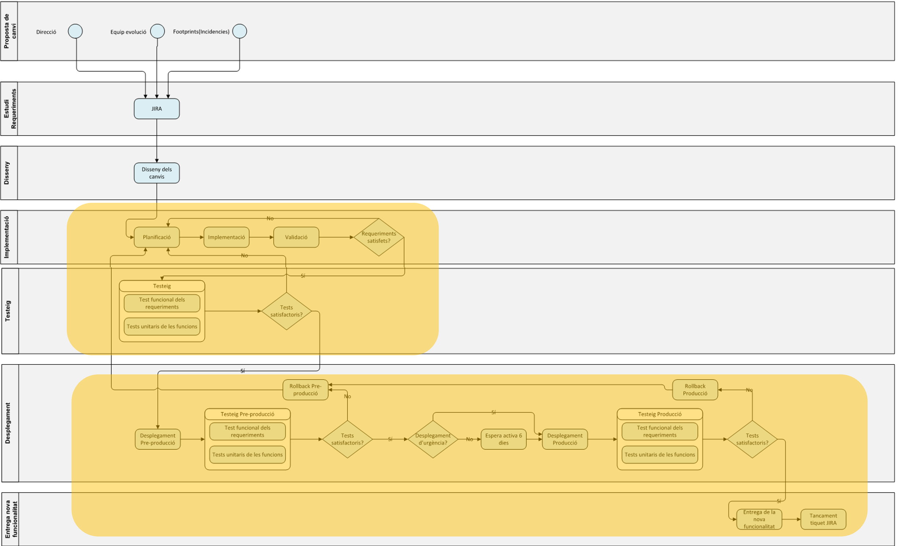

## 1. Objectius

La missió de la unitat de Qualitat del Consorci AOC es __l'assegurament de la qualitat dels serveis del Consorci AOC__. Els principals objectius de l'àrea son els següents:

* Automatització dels processos de desplegaments
* Reducció de riscos en el desplegament de serveis
* Reducció de tasques repetitives i manuals
* Detecció d’errors més ràpida i fàcil
* Reducció del temps entre el desenvolupament d’un nou evolutiu o correcció de bug i la posada en producció

## 2. Integracio Contínua

La informació sobre el servei d'Integració Contínua està disponible [aquí](https://github.com/ConsorciAOC-GiQ/ModelQA/blob/main/integracio_continua.md)

### 2.1. Guies

Amb la intenció de facilitar la incorporació dels projectes al flux CI/CD s'han creat unes guies que es poden accedir a través del següent [enllaç](https://github.com/ConsorciAOC-GiQ/ModelQA/blob/main//guies/README.md)

### 2.2. Eines

Per accedir a tota la informació sobre les eines d'integració contínua, clicar [aquí](https://github.com/ConsorciAOC-GiQ/ModelQA/blob/main/eines/README.md)

## 3. Cicle de vida de desenvolupament

A continuació es mostren els models en funció dels projectes del Consorci AOC.

### 3.1. Model estàndard

### 3.2. Model PSIS 

Model específic per PSIS, que bàsicament inclou una modificació en la etapa de Desplegament:

* Canvi de DNS abans de realitzar el desplegament 

### 3.3. Model extern

La modificació principal que inclou aquest model es l'externalització de les fases d'Implementació, Testeig, Desplegament i entrega que realitza directament el proveïdor sense interacció amb la unitat de suport tècnic del Consorci.

## 4. Etapes del cicle de vida

### 4.1. Anàlisi de requeriments i planificació

__L'anàlisi de requeriments__ es l'estudi de la necessitat del desenvolupament. Es en aquesta fase on es definiran i aplicaran tècniques que permetin analitzar els requisits necessaris pel bon desenvolupament.

L'objectiu de la __planificació__ del projecte es proporcionar un marc de treball que permeti realitzar estimacions raonables de recursos, així com la planificació en el temps del projecte.

A continuació es mostren els documents que es generen en aquesta etapa.

#### 4.1.1. Pla de projecte

Es necessari un document que reculli tots els punts imprescindibles per a poder conseguir els objectius establerts, es a dir, la referència des del principi fins al tancament del projecte.
El pla de projecte ha de proporcionar un resum d'alt nivell que permeti supervisar el progres i compliment dels objectius del projecte. 

#### 4.1.2. Requisits funcionals

Es necessari obtenir un catàleg ben definit d'aquells requisits funcionals del projecte que serà consensuat i aprovat pel cap de servei per evitar improvitzacions.

Aquest document també hauria d'incloure tots els requisits dels sistemes d'informació que inclouen el projecte.

#### 4.1.3. [Pla de qualitat](https://github.com/ConsorciAOC-GiQ/ModelQA/blob/main/pla_qualitat.md)

El pla de qualitat és un document en el que es detalla com ha de ser el procés que garantitzi la qualitat dels serveis.

#### 4.1.4. Plec tècnic

En cas d'haver de realitzar el desenvolupament mitjançant un proveïdor, es necessari realitzar el plec tècnic, on es recolliran, entre d'altres, els següents apartats:
* Justificació i objecte del contracte
* Durada i modificacions del contracte
* Especificacions i requisits del software

### 4.2. Disseny i implementació

### 4.3. Testeig

### 4.4. Desplegament i entrega

## 5. Altres enllaços

|Servei|Descripció|
|---|---|
|[**Jenkins**][1]| Llibreries d'utilitats de Jenkins |
|[**Gestió de configuració**][2]| Utilitats per a la configuració|
|[**Procediments interns**][3]| Documentació interna |

[1]:https://github.com/ConsorciAOC-GiQ/JenkinsCAOC
[2]:https://github.com/ConsorciAOC-GiQ/aoc-qa-agaporni
[3]:https://github.com/ConsorciAOC-GiQ/Documentacio
